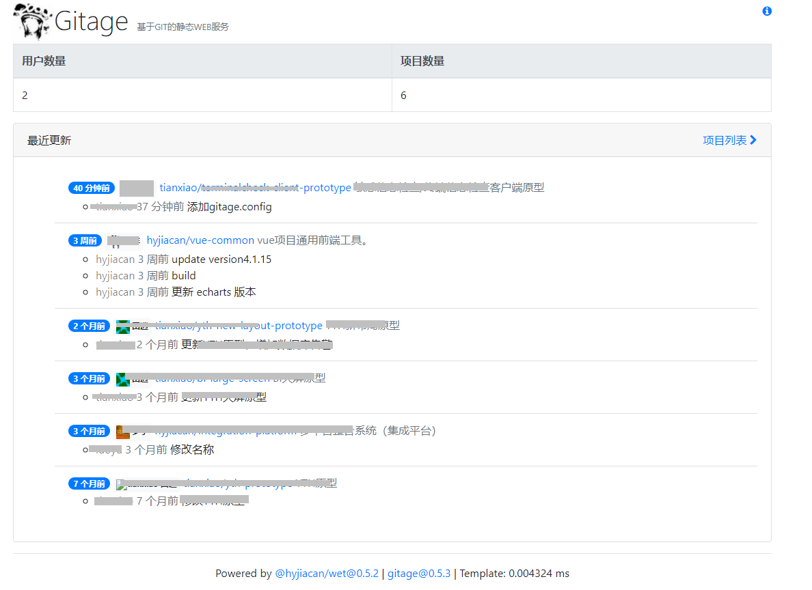
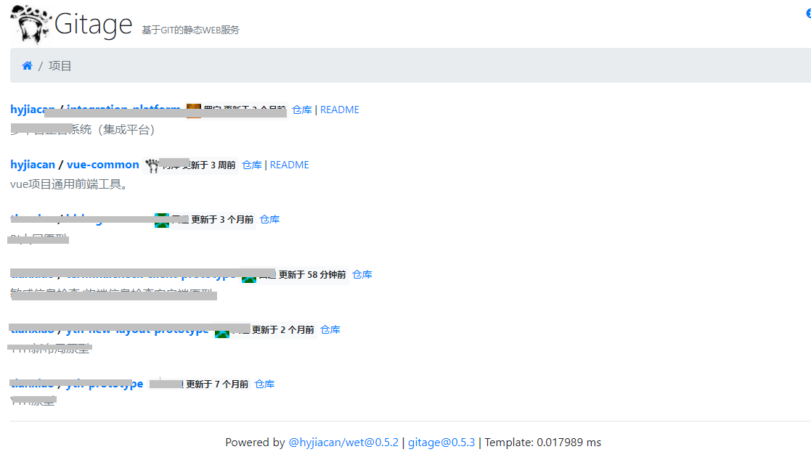

# gitage

基于 NodeJS 的静态 git-pages WEB服务。

依赖:

- 简单的 js 模板引擎 [wet](http://gitee.com/hyjiacan/wet)

运行时需要服务器上安装了 git, nodejs>8

目前支持的托管系统:

- [gogs](https://gogs.io/)
- [gitea](https://gitea.io/)

## 概述

gitage 运行在 nodejs 上，依赖 git (gitea, gogs, gitlab) 等托管系统的 web 勾子。

gitage 主要为团队/公司等非公开组织提供一个易于部署的 pages 服务。

gitage 提供 markdown 文件渲染，以及 [一些类型](#type-markdown) 文件的预览支持。

## 用法

> 首次运行，需要执行命令 `npm run download` 下载依赖的第三方包。

```shell script
npm run build
node dist/gitage.js
```

## 服务器配置

配置文件名为 `config` (区分大小写)，放置在部署根目录。

*config*
```
# 是否启用调试
DEBUG = false
# 启动服务的IP地址
HOST = 0.0.0.0
# 启动服务的端口
PORT = 1997
# 日志路径，可以指定为绝对路径或相对路径
LOG_PATH = logs
# 日志记录的级别
LOG_LEVEL = info
# 仓库部署路径，可以指定为绝对路径或相对路径
PROJECT_ROOT_PATH = projects
# 仓库检出临时目录，留空使用系统临时目录
PROJECT_CHECKOUT_TMP = 
```

> 在无此文件时，使用以上默认配置

> 注意：配置项名称均使用大写

## 仓库配置

在仓库下添加文件 `gitage.config.json`，其格式如下(可选):

```json
{
  "type": "markdown",
  "path": "docs",
  "index": "index.html",
  "tag": true,
  "branch": "master",
  "ignore": [
    "file",
    "dir",
    "..."
  ]
}
```

- `type` 标记部署内容的类型，目前仅支持 `markdown`，表示内容为 `markdown`，否则直接留空 **区分大小写**
- `path` 部署目录，默认为 `docs`
- `index` 部署目录下的索引页名称，默认为 `index.html/index.md` **区分大小写**
- `tag` 是否仅在收到 `tag` 时部署，默认为 `false` (计划中)
- `branch` 指定部署的分支，默认为 `master` (配置文件应该存放在主分支上，以避免无法正常读取)

在仓库的 web hook 上添加地址:

POST `http://127.0.0.1:1997/hook/`

`127.0.0.1` 是部署的服务器IP
`1997` 是部署的端口

### type-markdown

当 `type=markdown` 时，可以在仓库内指定一个目录 (可以是仓库根目录 `/`)，用于发布文档文件。

在此模式下，会扫描整个部署目录，并自动生成文档树。
每个文件都包含其最后更新的用户/日期以及更新消息。

> 目前支持 `.md|.markdown|.txt|.pdf|.docx` 类型文件在线查看。

## 截图





## 开发计划

[pdf2json]: https://www.npmjs.com/package/pdf2json

### next-version

- [ ] 每个仓库的 checkout 日志，单独写到一个文件中（每次一个文件）
- [ ] 插件支持
- [ ] 优化 `wet` 性能
